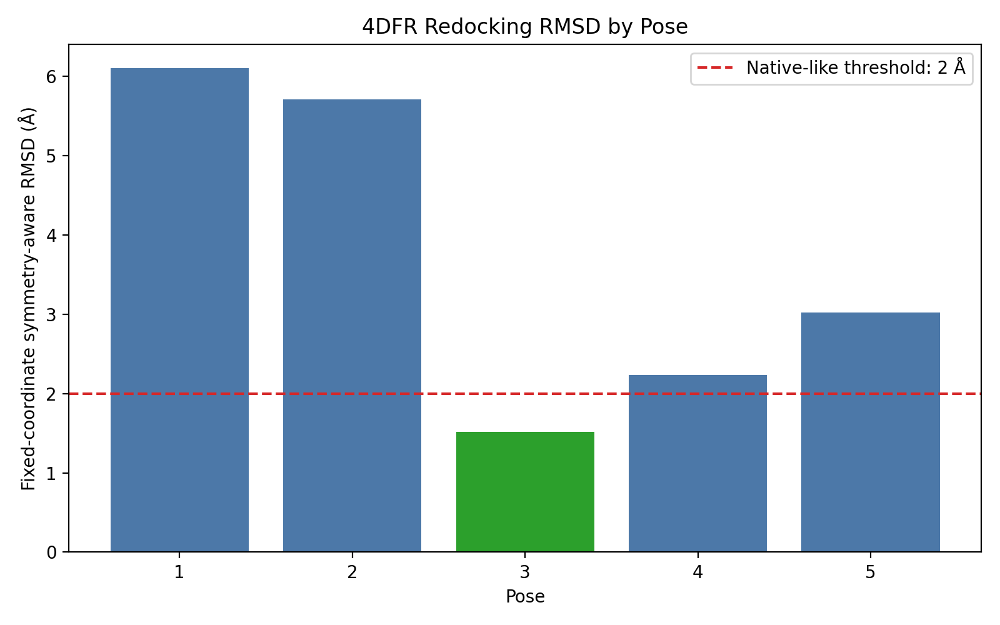
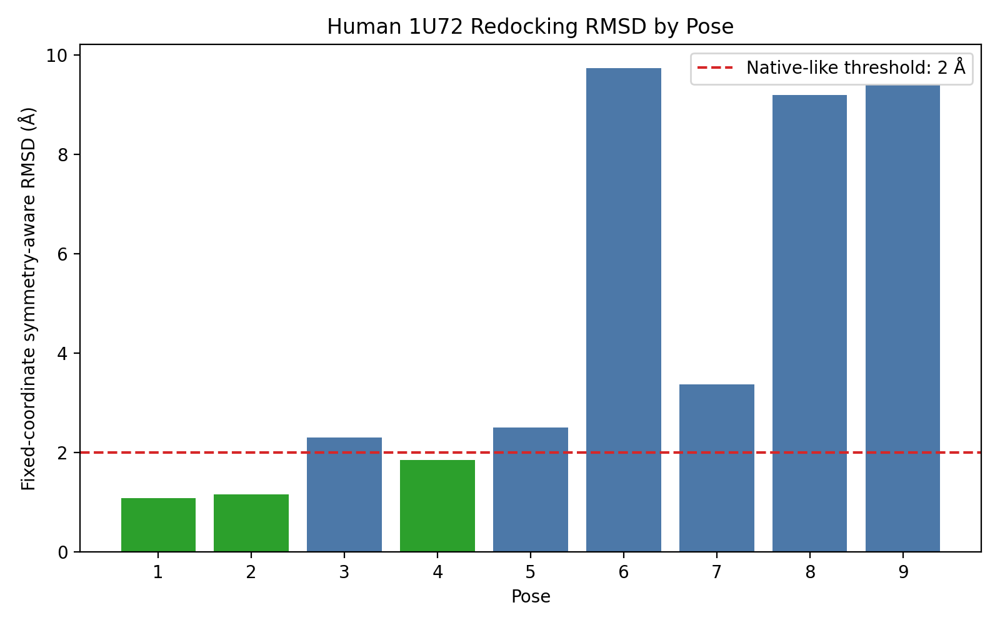
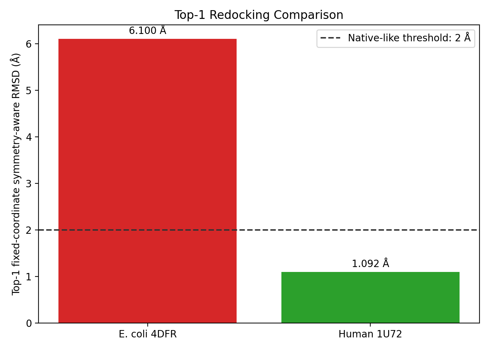
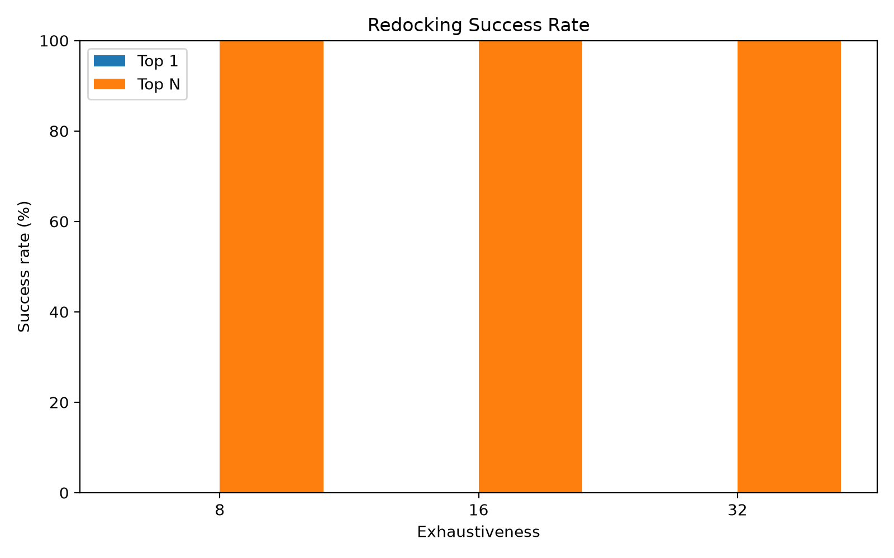
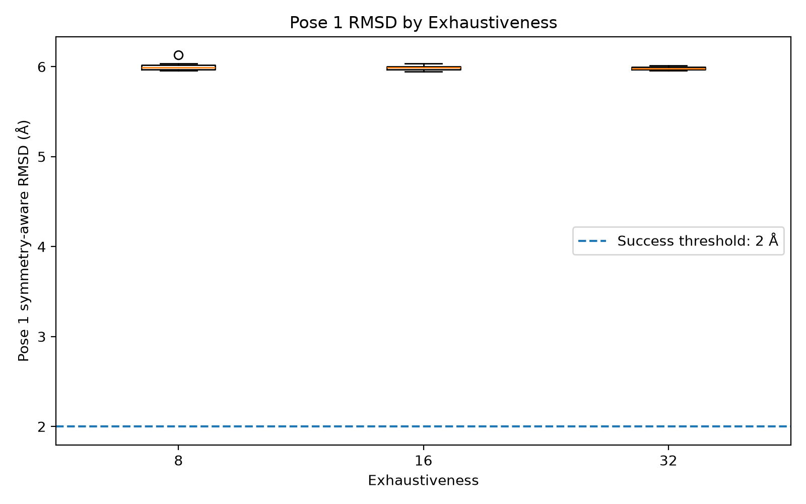
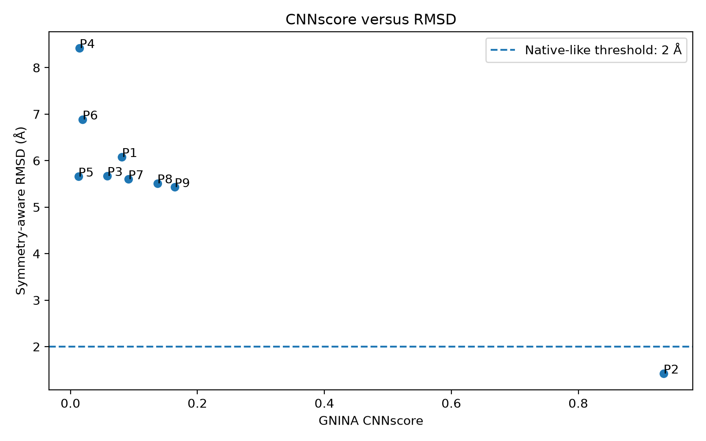
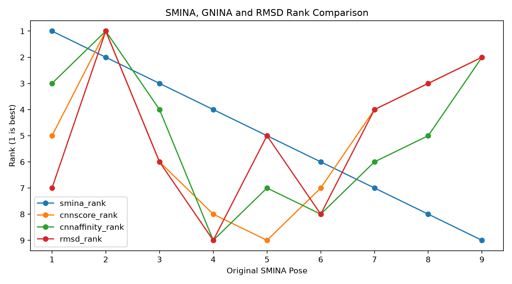

# DHFR–Methotrexate Redocking Benchmark

> Reproducible SMINA redocking, robustness analysis, and GNINA CNN rescoring for methotrexate bound to *E. coli* and human dihydrofolate reductase.

DHFR–methotrexate（MTX）を題材に、単発の再ドッキングから始め、ヒトDHFRとの比較、60 runsの頑健性評価、固定ポーズのGNINA CNN再スコアリングまで段階的に検証した教育用ポートフォリオです。

2026-08-16にOpenAI Codexを用いたAI支援再現性レビューを行い、主要計算の再実行、raw evidenceからの再解析、ハッシュ照合、ZIP再展開後の検査まで実施しました。範囲、結果、限界は[AI-assisted reproducibility review](AI_REPRODUCIBILITY_REVIEW.md)に記録しています。この確認は人間の査読、第三者認証、規制上のvalidationではありません。

このプロジェクトの中心は「ドッキングが動いたか」ではなく、次の2つを分離して評価した点にあります。

- **探索**：結晶構造に近いnative-like poseを候補内へ生成できたか
- **順位付け**：その候補をスコア1位として選べたか

## Key results

| Study | Scale | Top result | Interpretation |
|---|---:|---|---|
| *E. coli* DHFR 4DFR exploratory redocking | 5 poses | Best RMSD 1.516 Å at Pose 3; Pose 1 RMSD 6.100 Å | 探索は成功、Top 1順位付けは失敗 |
| Human DHFR 1U72 redocking | 9 poses | Pose 1: symmetry-aware RMSD 1.092 Å, SMINA affinity −11.5 kcal/mol | 探索とTop 1順位付けの両方に成功 |
| 4DFR robustness analysis | 20 seeds × 3 exhaustiveness = 60 runs | Top 1: 0/60; Top N: 60/60 | 候補生成は頑健だが誤Top 1も頑健 |
| GNINA proof-of-concept rescoring | 1 run, 9 fixed poses | CNNscore selected Pose 2, RMSD 1.422 Å | 同一候補集合でCNNがnative-like poseを1位へ救済 |

`RMSD ≤ 2.0 Å`を教育用のnative-like判定目安として使用しました。これは絶対的な品質保証ではありません。

## Research story

### 1. 4DFR: native-like poseは生成されたが1位ではなかった

初回の4DFR再ドッキングでは、Pose 3が結晶MTXに最も近い1.516 Åでした。一方、SMINAスコア1位のPose 1は6.100 Åでした。



この結果だけでは、偶然のseedや探索量不足を排除できません。そのため、次にseedとexhaustivenessを系統的に変えました。

### 2. Human 1U72: Top 1と最良構造が一致した

ヒトDHFR–NADPH–MTX三者複合体1U72では、9ポーズ中3ポーズが2 Å以内でした。Pose 1はSMINA affinityが最良で、4通りの等価原子mappingから最小値を採った固定座標・対称性考慮重原子RMSDも最小でした。





1U72と4DFRは生物種だけでなく、補因子、受容体前処理、seed、探索条件も異なるため、この比較から「ヒトDHFRの方が本質的にドッキングしやすい」とは結論していません。

### 3. 4DFR robustness: 探索量を増やしてもTop 1は改善しなかった

seed 1–20とexhaustiveness 8/16/32の組合せで60 runsを実行し、最大540ポーズを結晶MTXと比較しました。

- Top 1成功率：**0/60（0%）**
- Top N成功率：**60/60（100%）**
- Pose 1 RMSD：**5.990 ± 0.029 Å**
- 各runの最良RMSD：**1.502 ± 0.163 Å**
- native-likeな最良ポーズは2～4位に54/60 runs（90.0%）
- exhaustiveness 32は8の約3.89倍の時間を要したが、Top 1成功率は改善しなかった





この範囲では「さらに探索する」より、「前処理と順位付けを検証する」ことが合理的な次の一手でした。

### 4. GNINA: 同じ9ポーズをCNNで再順位付けした

SMINAが生成した座標を動かさず、GNINA 1.3.3 CPU版のCNNで再採点しました。対象runでは、SMINA Pose 1がRMSD 6.079 Å、Pose 2が1.422 Åでした。

- CNNscoreはPose 2を0.9343で1位へ選択
- CNNaffinityもPose 2を6.9280で1位へ選択
- Pose 1はCNNscore順位で5位へ低下
- GNINA empirical affinityだけではPose 1が1位のまま





この1 runでは、改善は新しい探索ではなく、CNNによる採点の違いとして解釈できます。ただし、単一runのproof of conceptであり、GNINAが常にSMINAより正しいとは結論していません。

## Methods at a glance

- **Docking**: SMINA 2020.12.10（AutoDock Vina 1.1.2ベース）
- **Rescoring**: GNINA 1.3.3、固定ポーズ、`--score_only --cnn_scoring rescore --no_gpu`
- **GNINA runtime**: CUDA 12.8 / cuDNN 9.10.2.21のYAMLとLinux x86-64完全lockを収録
- **Structures**: RCSB PDB `4DFR`、`1U72`、ligand `MTX`
- **Ligand preparation**: Open Babelによる教育用pH 7.4処理と3D生成
- **RMSD**: RDKit `CalcRMS`、座標を再アラインしない、重原子、対称性考慮
- **Success threshold**: RMSD ≤ 2.0 Å
- **Visualization**: PyMOL、pandas、matplotlib

詳細は[Methods](docs/METHODS.md)、[Results](docs/RESULTS.md)、[Reproducibility](docs/REPRODUCIBILITY.md)、[Independent validation](docs/VALIDATION.md)、[Limitations](docs/LIMITATIONS.md)を参照してください。

GitHubへの初回登録と既存レポジトリへの修正版反映は[日本語のアップロード手順](docs/GITHUB_UPLOAD_GUIDE_JP.md)にまとめています。
監査後の修正内容は[Changelog](CHANGELOG.md)にまとめています。

## Repository layout

```text
.
├─ environment/              # Conda環境定義
├─ data/
│  ├─ reference/            # hash固定したPDB/SDF入力
│  └─ raw/                  # robustness 60 runsとGNINA POCのraw evidence
├─ scripts/
│  ├─ docking/               # 4DFR、1U72、robustness、GNINA
│  ├─ analysis/              # RMSD・集計
│  ├─ visualization/         # PyMOL・グラフ
│  ├─ tests/                 # RDKitを使う科学計算回帰テスト
│  └─ verify_portfolio.py    # 公開パッケージのオフライン整合検査
├─ results/
│  ├─ poses/                 # 保存済みSMINAポーズ
│  ├─ logs/                  # 対応するSMINAログ
│  ├─ summary/               # CSV要約
│  └─ figures/               # 代表図
├─ docs/                     # 方法、結果、再現性、限界
├─ .github/workflows/        # GitHub上の自動整合検査
├─ AI_ASSISTANCE.md
├─ AI_REPRODUCIBILITY_REVIEW.md
├─ THIRD_PARTY_NOTICES.md
└─ LICENSE.md
```

## Quick verification

Python標準ライブラリだけで、公開ZIPの構造、SDFレコード数、主要CSVの不変条件、画像、Markdownリンク、一般的な個人パス・秘密情報パターンを確認できます。

```bash
python scripts/verify_portfolio.py
```

この軽量検査はSMINA、GNINA、RDKitの科学計算を再実行するものではありません。GitHub Actionsではこれに加え、RDKitによる4DFR・1U72 RMSD、raw 60-run archiveからのrobustness集計、raw GNINA出力からの比較CSVを実際に再計算する科学計算回帰テストも実行します。

## Reproduce the docking workflows

LinuxまたはWSL2で実行します。既定では`data/reference/`のhash固定入力を使うため、入力取得のネットワーク接続は不要です。

```bash
mamba env create -f environment/environment_docking.yml
conda activate docking
```

Linux x86-64で監査時と同じpackage buildを使う場合は、完全lockも利用できます。

```bash
conda create --name docking-locked --file environment/docking-linux-64-explicit.txt
conda activate docking-locked
```

4DFR:

```bash
bash scripts/docking/run_4dfr_redocking.sh
```

Human 1U72:

```bash
bash scripts/docking/run_human_1u72_redocking.sh
```

RMSD解析:

```bash
mamba env create -f environment/environment_analysis.yml
conda activate analysis
python scripts/analysis/calculate_symmetry_rmsd.py \
  --crystal data/reference/1U72_MTX_crystal_historical.sdf \
  --docked results/poses/1u72_mtx_redocked.sdf \
  --csv symmetry_rmsd_results.csv
```

RCSBから現在の入力を再取得して比較する場合のみ、`INPUT_MODE=download`を指定します。RCSBサービス側のSDF表現が変化するとhistorical RMSDは完全一致しない可能性があります。

RobustnessとGNINAについては、集計前のraw evidenceも`data/raw/`に収録しました。具体的な再生成手順は[Reproducibility](docs/REPRODUCIBILITY.md)に記載しています。GNINAバイナリ自体は同梱していません。

## What this project demonstrates

- 再現可能な入力取得、seed、環境、ログ、ハッシュの記録
- ドッキングスコアと構造再現性を混同しない評価
- Top 1とTop Nを分けた探索・順位付け診断
- seedと探索強度を使った頑健性評価
- 同一候補集合に対する古典スコアとCNN再スコアリングの比較
- 失敗結果を消さず、次の検証へ接続する判断

## Scope and limitations

これは教育用の再ドッキング・ベンチマークです。結合自由エネルギー、実測活性、選択性、薬効を証明するものではありません。受容体前処理、プロトン化、部分電荷、保存水、タンパク質柔軟性、単一リガンド状態などに明確な限界があります。

## AI-assisted development

コード、文書、公開用構成にはAI支援を利用しました。当初の実習の計算と証拠保存はユーザーが行い、公開版の技術監査ではAIも主要計算の再実行、raw evidenceの再解析、整合修正、検査を行いました。役割分担は[AI_ASSISTANCE.md](AI_ASSISTANCE.md)、実施した検証は[AI_REPRODUCIBILITY_REVIEW.md](AI_REPRODUCIBILITY_REVIEW.md)を参照してください。

## Data, software, and license

再現性固定用のRCSB PDB/SDF snapshot、60-run raw archive、GNINA POCの入出力を同梱しています。RCSB PDB archive/API dataはCC0 1.0で、構造著者とRCSB PDBへの帰属情報を[THIRD_PARTY_NOTICES.md](THIRD_PARTY_NOTICES.md)にまとめています。SMINA/GNINAなどの実行バイナリは同梱していません。

この公開準備版はポートフォリオレビュー用で、再利用許諾はまだ付与していません。[LICENSE.md](LICENSE.md)を参照してください。

## References

1. RCSB PDB: [4DFR](https://www.rcsb.org/structure/4DFR), DOI [10.2210/pdb4DFR/pdb](https://doi.org/10.2210/pdb4DFR/pdb)
2. RCSB PDB: [1U72](https://www.rcsb.org/structure/1U72), DOI [10.2210/pdb1U72/pdb](https://doi.org/10.2210/pdb1U72/pdb)
3. Koes DR, Baumgartner MP, Camacho CJ. Lessons learned in empirical scoring with smina from the CSAR 2011 benchmarking exercise. *J Chem Inf Model.* 2013. https://doi.org/10.1021/ci300604z
4. McNutt AT, et al. GNINA 1.3: the next increment in molecular docking with deep learning. *J Cheminform.* 2025;17:28. https://doi.org/10.1186/s13321-025-00973-x
5. RDKit `CalcRMS`: https://www.rdkit.org/docs/source/rdkit.Chem.rdMolAlign.html
6. Open Babel command line: https://openbabel.org/docs/Command-line_tools/babel.html
